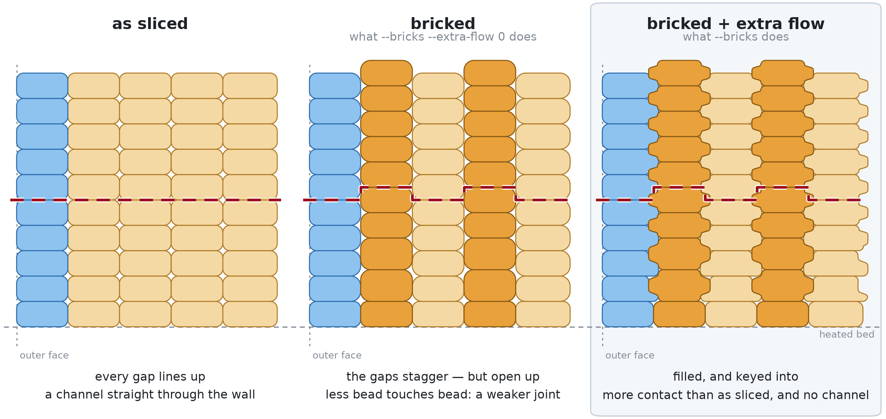

# corbel

**A post-processor for G-code, written in Rust. Supports BrickLayers and ZAA.**

Two independent transforms in one binary, each doing something to a print your slicer will not:

| | transform | what it does |
|---|---|---|
| 🧱 | **[BrickLayers](#-bricklayers)** — `--bricks` | makes layers **interlock** instead of stacking as independent flat sheets, which is exactly where FDM prints crack |
| 🪄 | **[Z anti-aliasing](#-z-anti-aliasing)** — `--zaa` | follows the model's surface **inside** a layer, so a shallow top comes out as a ramp instead of a staircase |

Run either, or both in one pass. **You have to name at least one** — a run naming neither is refused, because this is handed your only copy of a file by a slicer that swallows everything it prints. Nothing else needs filling in: layer height, line width and flow are read from your file.

```
corbel --bricks --zaa
```

---

##  Install

**One-liner.** Downloads the latest release into `~/corbel` (`%USERPROFILE%\corbel` on Windows), checks the published SHA-256 sums, and prints the line to paste into your slicer. Run it again to update in place.

```sh
# Linux / macOS
curl -fsSL https://raw.githubusercontent.com/erkexzcx/corbel/main/deploy.sh | bash

# Windows (PowerShell)
irm https://raw.githubusercontent.com/erkexzcx/corbel/main/deploy.ps1 | iex
```

> 🛡️ **Windows: "An Application Control policy has blocked this file".** These builds are unsigned, and [Smart App Control](https://support.microsoft.com/en-us/topic/what-is-smart-app-control-285ea03d-fa88-4d56-882e-6698afdb7003) blocks anything unsigned. Turn it off in **Windows Security → App & browser control → Smart App Control settings**.

**By hand.** Take your platform's file from the [latest release](https://github.com/erkexzcx/corbel/releases/latest) — Linux, macOS and Windows, x86-64 and arm64 — rename it to `corbel` and `chmod +x` it. **From source**, needs only [Rust](https://rustup.rs):

```sh
git clone https://github.com/erkexzcx/corbel.git
cd corbel && cargo build --release
```

---

## 🖨️ Use

One line goes into your slicer's **post-processing scripts** field: the path to the binary plus the transforms you want. The slicer appends the G-code path itself.

```
~/corbel/corbel --bricks --zaa              # both
~/corbel/corbel --bricks                    # interlock the walls only
~/corbel/corbel --zaa                       # ramp the shallow tops only
"C:\Users\you\corbel\corbel.exe" --bricks   # Windows: full path, quoted
```

On Linux and macOS `~` works in both OrcaSlicer and Bambu Studio; on Windows give the full path, quoted if any folder name contains a space. In OrcaSlicer and Bambu Studio the field is under **Process → Others → Post-processing Scripts**, in Advanced or Expert mode. Plain `.gcode` and `.bgcode` are both accepted, and the output keeps whichever came in.

> 🙈 **OrcaSlicer's preview will not show the change — and that is normal.** It draws the toolpaths as sliced, before post-processing; the exported file *is* processed, so export it and open that file back in a slicer to check. **Bambu Studio previews after post-processing**, so the change shows straight away.

You can run it yourself instead. `-o` writes a new file and leaves the input untouched; drop it and the file is rewritten in place. `-v` says whether anything happened:

```sh
corbel --bricks --zaa -v -o modified.gcode original.gcode
# corbel: 240 layers, 1365 perimeter loops, 533 raised by 0.100 mm
# corbel: 13 more were left flat where the wall ends and something is printed over it
# corbel: 5062.0 mm filament, 16.7% of it in raised loops; a flow of 1.025 adds 1.07% to the part
# corbel: 1168 surface moves on 86 layers followed from -0.080 to +0.100 mm of their plane, written as 3041 moves
# corbel: 69.9 mm filament in those surfaces, re-metered by -1.83% for the gaps they really cross
```

Zero raised loops means the file gave bricking nothing to work with — usually a single wall, or unrecognised region markers. `no surface shallow enough to smooth` means the part has no shallow top, which a plain box genuinely does not.

### Options

```
corbel [OPTIONS] <--bricks|--zaa> <GCODE>
```

| option | |
|---|---|
| `--bricks` | 🧱 turn bricklayering on |
| `--extra-flow <PERCENT>` | 🧱 extra flow for the walls, `0` to `50` (default `5`) — see [how much flow it adds](#-how-much-flow-it-adds) |
| `--zaa` | 🪄 turn Z anti-aliasing on |
| `-o, --output <PATH>` | write here instead of overwriting the input |
| `-v, --verbose` | print a summary of what changed |
| `--force` | run anyway on a file already processed, or on one that does not read as G-code |
| `-h, --help` / `-V, --version` | the same list, and which release this is |

Z anti-aliasing has no dials: how wide a tread is worth following is a *slope* off your layer height, and how finely a surface is sampled comes from the grid it is measured on. A dial belonging to a transform you did not name is accepted and ignored, so a leftover word in a slicer field never fails a print.

> 🔐 **Rewriting a file in place gives it a new identity.** The result is written beside the target and renamed over it, which is what makes a crash leave your original intact — but a rename publishes a new inode, so the owner, any ACL or security label, and every other name hard-linked to the file stay behind with the old one. Permission bits are copied; the rest cannot be from the standard library alone, so what can be detected is warned about before writing.

---

## 🧱 BrickLayers

`--bricks`

<picture>
  <source media="(prefers-color-scheme: dark)" srcset="img/interlock-dark.png">
  
</picture>

*Seen end-on: columns are perimeter loops, rows are layers, and the red line is the join between two layers — the plane an FDM part splits along.*

**The middle step is the tool doing harm. The third is why it is worth it.**

1. **As sliced.** Two beads side by side leave a small gap where their rounded edges meet, and every layer breaks at the same height, so those gaps line up into a channel running through the wall — which is where the part splits.
2. **Bricked.** Every other loop rises half a layer, so the gaps no longer line up — but they also get *bigger*, because on a flat plane the nozzle's underside presses each gap shut as it passes and over a staggered seam half of each is out of reach. On its own, this step makes the joint weaker.
3. **Bricked + extra flow.** The material the walls gain fills those gaps and keys into them, so the wall ends with **more** contact than as sliced and no aligned channel to split along.

The gaps are drawn far larger than life — on a 0.2 mm layer they are a few microns across.

**What it touches.** Every wall, and only walls — infill, bridges, gap fill and the surfaces come out exactly as sliced, so it is never a global flow bump. Two walls are enough; three or more interlocks twice as much.

- **The first layer on the bed is left exactly as sliced.** Nothing presses a bead there, so surplus spreads sideways instead of filling anything — on a Benchy it filled in the recessed nameplate, which is exactly one layer deep. A raised column climbs to its half layer over two layers rather than stepping up in one.
- **The outer wall gets the flow and is then moved inward by half the width it gains**, so the gain feeds the joint behind it and the commanded outer face stays where the slicer drew it. What it gains is `flow - 1` of its *spacing*, not of its nominal width.
- **A `G2`/`G3` arc moves with it**, keeping its centre and changing radius by the offset, with `I`/`J` restated. On two real arc-fitted slices the gap between commanded and landed radius stayed inside what three-decimal coordinates already put there (0.45 µm median, against the input's 0.39 µm); a loop whose arcs cannot be moved without distorting their circle is left as sliced, 3 beads of 21396 on a Benchy.

The compensation is exact on the toolpath, but plastic is looser than a coordinate — the walls behind the visible one keep their gain, and a raised bead is out of reach of the nozzle's underside, so a bricked part can come out slightly over nominal in XY. If yours does, `--extra-flow 0` leaves only the raise, every bead metered as sliced and no wall moved; beyond that, your slicer's XY size compensation trims a measured offset.

---

### 📐 How much flow it adds

**`--extra-flow` is the extra a wall takes when your layer is as thick as your nozzle.** Print thinner than that — everyone does — and you get proportionally less:

> **extra flow ≈ `--extra-flow` × (layer height ÷ nozzle diameter)**

So the default of `5` gives **+2.5%** on a 0.2 mm layer through a 0.4 mm nozzle. Both numbers are read from your file, on every layer.

**Why those two numbers.** A bead is a rectangle with a half-round bulge on each side, and two side by side leave a corner empty where the bulges meet, which the nozzle's flat underside normally squashes shut. Bricklayering lifts every other wall half a layer, putting that corner out of reach, so the extra flow fills it instead — and its size depends on the **layer height** and the **line width**, both stated in your file.
| nozzle | line width | layer | layer ÷ nozzle | extra flow |
|---|---|---|---|---|
| 0.2 | 0.22 | 0.10 | 50% | +2.56% |
| 0.4 | 0.45 | 0.08 | 20% | +0.94% |
| 0.4 | 0.45 | 0.16 | 40% | +1.96% |
| **0.4** | **0.45** | **0.20** | **50%** | **+2.50%** |
| 0.4 | 0.45 | 0.28 | 70% | +3.65% |
| 0.6 | 0.65 | 0.30 | 50% | +2.61% |
| 0.8 | 0.85 | 0.40 | 50% | +2.66% |

Read down the 50% rows — 2.56, 2.50, 2.61, 2.66. Nozzle size barely matters on its own; what matters is **how thick your layer is next to your nozzle**. It is `≈` because the flow follows the **line width** your file states, which stock profiles set at 1.06 to 1.13 times the nozzle, keeping it within **±7%** of the simple form.

**If you want more or less of it**, set `--extra-flow` anywhere from 0 to 50:

| `--extra-flow` | 0.4 mm nozzle, 0.2 mm layer | 0.4 mm nozzle, 0.28 mm layer |
|---|---|---|
| `0` | none — metered as sliced | none — metered as sliced |
| `2.5` | +1.25% | +1.83% |
| `5` (default) | +2.50% | +3.65% |
| `10` | +5.00% | +7.31% |
| `50` | +25.0% | +36.5% |

The top of the range is for sweeping a test print rather than printing with, and there is a ceiling nobody picked: a bead can be widened until its edge reaches the centre of the loop beside it, **×1.89** on the profile above, which nothing comes within 15% of even at `50`.

**What it costs on the whole part**, measured on two real slices at the default:

| part | filament in raised loops | added to the whole part |
|---|---|---|
| Benchy, 2 walls | 16.7% | **+1.07%** |
| Cylinder, solid wall throughout | 45.5% | **+2.30%** |

**What gets it, and what does not** — measured per region on a real Benchy at the default:

| region | flow |
|---|---|
| Outer wall | **×1.0219** |
| Inner wall | **×1.0230** |
| Overhang wall | **×1.0226** |
| Solid infill, sparse infill, gap fill, bridges, top and bottom surface, brim | ×1.0000 |

So it is never a global flow bump. Those three sit a little under the 1.025 the profile asks for because the first layer on the bed is metered as sliced.

**Where the numbers come from.** The width is read from whichever states it first — the `SLIC3R_*` configuration your slicer exports to a post-processing script, a `.bgcode` container's metadata, or the settings block appended to plain `.gcode` — with a percentage resolved against `nozzle_diameter`. Layer heights are measured from the commanded Z one layer at a time, so an adaptive slice is metered against what it printed. A file stating no width, as Cura's do, falls back to the reference profile for both the flow and the inward move, and `-v` says so.

The formula is the slicer's own bead model: PrusaSlicer's [`Flow::rounded_rectangle_extrusion_spacing`](https://github.com/prusa3d/PrusaSlicer/blob/master/src/libslic3r/Flow.cpp) spaces beads at `width − height × (1 − π/4)` and meters each at `height × spacing`. Verified against three real slices: neighbouring loops **0.4074 mm** apart against the formula's 0.4071, and each bead metered **0.0773–0.0774 mm²** against 0.0774, where a nominal-width model predicts 0.0855. The default itself is a **chosen constant**, small on purpose because it is paid on every wall and sets how far the visible wall is drawn in; only how it *scales* is derived. Micro-CT work supports the direction without having been used to fit it: [Faizaan *et al.* 2025](https://doi.org/10.1038/s41598-025-87348-2) found void fractions of 0.117% to 4.99% in concentric-filled PLA, **axially connected in every reconstruction**.

---

## 🪄 Z anti-aliasing

`--zaa`

**A layer is flat and your model usually is not.** Wherever a surface is shallower than about 45° the print leaves a staircase: each tread is one layer's surface laid at one height, each riser is a full layer. This follows the surface across each tread instead, varying the height of the extrusion *within* the layer by up to half a layer either way and metering each stretch for the gap it actually crosses.

<picture>
  <source media="(prefers-color-scheme: dark)" srcset="img/contour-dark.png">
  
</picture>

*Seen end-on, on a 7° slope: columns are beads, rows are layers, blue is the wall you can see, and the dashed line is where the model's surface really runs. About four beads share a tread at 0.2 mm layers, so what you get is a finer staircase — a step a quarter the size of the one it replaced.*

**Consecutive treads join.** One ends half a layer **above** its plane exactly where the next begins half a layer **below** its own, so the full-height riser between them is gone.

**It does not need your model.** Every other implementation raycasts the mesh — [GCodeZAA](https://github.com/Theaninova/GCodeZAA) wants an STL per object and its position typed in, [BambuStudio-ZAA](https://github.com/adob/BambuStudio-ZAA) works inside the slicer. This recovers the surface from the file, because **a slicer takes its cross-section through the middle of a layer**: a layer's outline is where the surface passes half a layer *below* the plane, and the next layer's where it passes half a layer *above*. A straight climb across that strip reproduces a flat slope exactly — the case that stair-steps in the first place.

**What it touches.** The top surface, the ironing over it, and the walls — which matter more than they sound: a slope steeper than about 13° leaves a tread narrower than the wall stack on it, so your slicer emits no top-surface region at all and the staircase is entirely wall. The visible wall is always followed, and only ever lowered, since a bead standing proud is out of reach of the nozzle's underside and free to bulge on the face of the part. The walls behind it are followed when this runs alone, and left alone when bricklayering runs in the same pass, because lowering a wall onto a bead that transform has raised would close a gap your slicer metered open. Infill, bridges and anything with a layer printed over it come out exactly as sliced.

**What it costs.** Each stretch is metered for its own gap, so one sitting low takes less material and one sitting high takes more; over a tread the two cancel. Measured with `--zaa` alone:

| part | followed | how far off their plane |
|---|---|---|
| 60 mm spherical cap | 2678 moves, 17 of 90 layers | −0.074 to +0.100 mm |
| 180 mm spherical cap | 15824 moves, 52 of 240 layers | −0.082 to +0.100 mm |
| 60 mm cone, 1.9° | 1712 moves, 5 of 20 layers | −0.091 to +0.100 mm |
| Benchy, 2 walls | 1608 moves, 86 of 240 layers | −0.081 to +0.100 mm |
| Cube, and a flat plate with a boss on it | nothing — every face is vertical or flat | — |

A curve needs a move per bend, so the exported file grows by a few per cent on a part with shallow tops and not at all on one without them; a **straight** climb costs nothing, since your printer interpolates height along a move already.

**A minority of layers is the right answer, not a shortfall.** A staircase only shows where a layer leaves a tread wider than the bead standing on it. On the 60 mm cap, 19 of its 90 layers leave such a tread and 17 are followed; weighted over those, the surface comes out **0.32 of half a layer** from where the slicer put it across 56% of their length. A Benchy is a poor subject — its hull flares outward, only 18 of its 241 layers leave a tread at all, and it gets 0.03 across 8.8%. Print a shallow dome, a low cone or a wide chamfer to see the difference.

**How shallow it goes comes from your layer height.** The widest tread it will follow is the one a **1° slope** leaves — 11.5 mm at 0.2 mm layers, 4.6 mm at 0.08 mm ones. As an angle it means the same thing on every profile and moves with an adaptive slice, and the fade runs a further quarter *past* that slope, so the widest tread it follows does not end in a step of its own.

**What it will not do.** A flat top is left alone: nothing is printed above it, so there is no far edge to climb to, and lowering it would starve a surface that was correct as sliced. So is a ledge with a wall on it, whose tread looks like a slope's and is not one — the layer below tells them apart. A bore going straight down leaves no tread to follow, though one that opens upward *is* followed, so long as it is at least a bead across and its lip is no wider than that 1° slope: narrower than a bead and it cannot be told from the gap the slicer leaves between two neighbouring lines, wider than the slope and what surrounds it is not a lip but the inside of the part. And a surface curving sharply inside one tread is approximated by a straight climb, which errs toward the plane rather than away from it.

---

## ✨ Why this one

Common to both transforms:

- 🔀 **Two transforms, one pass** — run together they compose in a single read, and they own different regions of the print, so neither disturbs the other.
- 🎛️ **Nothing to fill in, nothing to check first** — line width and nozzle come from your file, layer height is measured off the print itself, and PrusaSlicer, SuperSlicer, OrcaSlicer, Bambu Studio and Cura share one code path.
- 📦 **One binary, any file size, any character set** — streamed rather than loaded, so a 300 MB slice costs the same memory as a small one, and read as bytes, so an object name in any encoding passes through untouched.
- 🛡️ **Your file cannot be destroyed** — written aside and moved into place; a file that does not read as G-code is refused before a byte is written, and a second run is refused rather than stacking. Every change is stamped, so `grep corbel` tells you it ran and where.

Against [GeekDetour/BrickLayers](https://github.com/GeekDetour/BrickLayers) and [TengerTechnologies/Bricklayers](https://github.com/TengerTechnologies/Bricklayers), both Python scripts that ask you to change slicer settings first:

- 🐍 **No Python, and no numbers to keep in sync** — no interpreter, no `-layerHeight` to match your profile, no extrusion multiplier to guess.
- 🔧 **No slicer settings to change first** — arc fitting stays on, wall order is read rather than dictated, and `.bgcode` is read and written natively with thumbnails and config copied byte for byte.
- 🧵 **No stringing from the raise** — a height change rides a travel the printer was already making, instead of stopping the toolhead over a seam with a primed nozzle.
- 🧩 **Two walls are enough, and the visible wall is in on it** — a region with one internal loop is bricked against the wall you can see; that wall takes the same flow as every other and is drawn back in by half of what it gains.

Against [Theaninova/GCodeZAA](https://github.com/Theaninova/GCodeZAA), the post-processor that Z anti-aliasing started as:

- 🧊 **No STL, object name or position to type in** — the surface is recovered from the outlines the slicer already wrote, exact for a flat slope and erring toward the plane for anything else.
- 📏 **No reach or resolution to pick** — how shallow a tread must be is a slope off your layer height, and the grid comes from the size of your part, spending a fixed budget of cells so a small part is measured finely rather than cheaply.
- 🌀 **Arcs work, on any firmware** — `G2`/`G3` are resampled rather than skipped, each sampled for its own radius to within a micron; no Klipper requirement, no wall order to set first.

---

## 🙏 Credits

Neither idea started here. This is a Rust implementation of both, without their prerequisites.

**BrickLayers** — [TengerTechnologies/Bricklayers](https://github.com/TengerTechnologies/Bricklayers), the original script and the video that started it, and [GeekDetour/BrickLayers](https://github.com/GeekDetour/BrickLayers), the fork that worked out most of what a real slice needs.

**Z anti-aliasing** — [adob/BambuStudio-ZAA](https://github.com/adob/BambuStudio-ZAA), built into a slicer fork where the mesh is on hand to raycast; [Theaninova/GCodeZAA](https://github.com/Theaninova/GCodeZAA), the standalone post-processor and the source of the seam rule that keeps the visible wall from standing proud; and [Song et al., *Anti-aliasing for fused filament deposition*](https://arxiv.org/abs/1609.03032), the paper both trace back to.

Licensed GPL-3.0-or-later.
